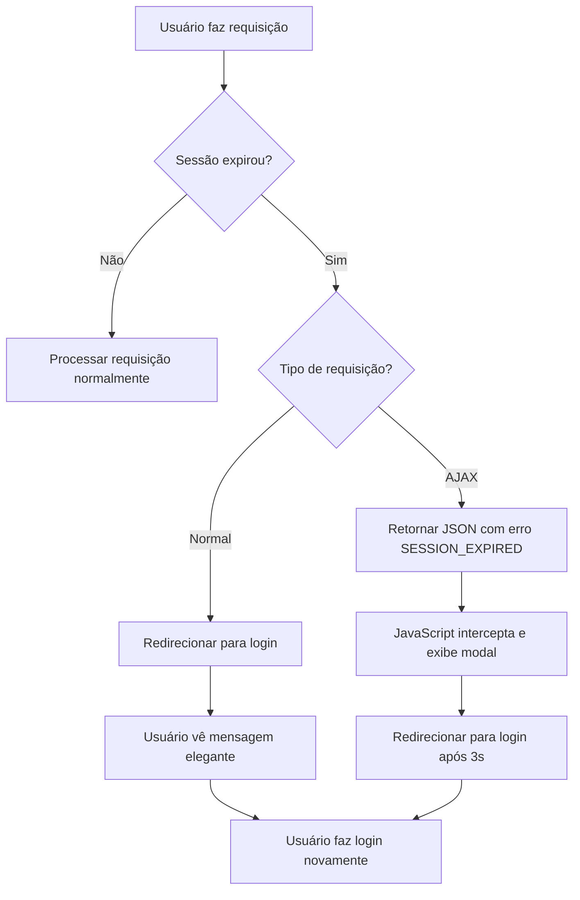

# Tratamento Elegante de Expiração de Sessão

## 📋 Visão Geral

Este sistema implementa um tratamento elegante para a expiração de sessão, evitando que o usuário veja a mensagem "419 Page Expired" e fornecendo uma experiência mais amigável.

## 🔧 Componentes Implementados

### 1. **Middleware de Verificação de Sessão** (`CheckSessionExpiration`)
- Verifica automaticamente se a sessão expirou por inatividade
- Faz logout automático quando necessário
- Suporta requisições AJAX e normais
- Invalida a sessão e regenera o token CSRF

### 2. **Middleware de Tratamento de Erros** (`HandleSessionExpiration`)
- Intercepta exceções `TokenMismatchException` (erro 419)
- Trata requisições AJAX com resposta JSON
- Redireciona requisições normais para login

### 3. **Handler de Exceções Global** (`bootstrap/app.php`)
- Intercepta erros 419 em nível global
- Detecta contexto de tenant vs central
- Fornece mensagens personalizadas

### 4. **JavaScript de Interceptação** (`session-handler.js`)
- Intercepta requisições AJAX (fetch e jQuery)
- Exibe modal elegante para sessão expirada
- Redireciona automaticamente para login

## 🚀 Como Usar

### 1. **Incluir o JavaScript no Layout**

Adicione o seguinte no seu layout principal (ex: `resources/views/layouts/app.blade.php`):

```html
<!-- Antes do fechamento do </body> -->
<script src="{{ asset('assets/js/session-handler.js') }}"></script>
```

### 2. **Para Layouts Específicos**

Se você tem layouts diferentes para tenant e central:

```html
<!-- Layout Central -->
<script src="{{ asset('assets/js/session-handler.js') }}"></script>

<!-- Layout Tenant -->
<script src="{{ asset('assets/js/session-handler.js') }}"></script>
```

### 3. **Configuração Automática**

O sistema funciona automaticamente uma vez implementado. Não requer configuração adicional.

## 📊 Fluxo de Funcionamento



## 🎯 Benefícios

### ✅ **Experiência do Usuário**
- **Sem mensagens técnicas**: Usuário não vê "419 Page Expired"
- **Modal elegante**: Notificação visual clara e profissional
- **Redirecionamento automático**: Não precisa clicar em "voltar"
- **Mensagens em português**: Interface localizada

### ✅ **Funcionalidade Técnica**
- **Interceptação automática**: Funciona com todas as requisições
- **Suporte AJAX**: Trata requisições assíncronas
- **Detecção de contexto**: Funciona em tenant e central
- **Logout seguro**: Invalida sessão e regenera tokens

### ✅ **Manutenibilidade**
- **Código modular**: Middlewares separados por responsabilidade
- **JavaScript reutilizável**: Funciona em qualquer página
- **Configuração centralizada**: Fácil de ajustar mensagens

## 🔧 Configurações Disponíveis

### **Tempo de Redirecionamento**
No arquivo `session-handler.js`, linha 85:
```javascript
setTimeout(() => {
    window.location.href = this.getLoginUrl();
}, 3000); // 3 segundos - ajuste conforme necessário
```

### **Mensagens Personalizadas**
No arquivo `bootstrap/app.php`, linhas 55-61:
```php
return redirect()->route('login')->with('error', 'Sua mensagem personalizada aqui.');
```

### **Tempo de Sessão**
No arquivo `.env`:
```env
SESSION_LIFETIME=120 # minutos
```

## 🧪 Testando

### **1. Teste Manual**
1. Faça login na aplicação
2. Aguarde o tempo de sessão expirar (ou ajuste no `.env`)
3. Tente fazer uma ação (clique em botão, submit de formulário)
4. Verifique se aparece o modal elegante

### **2. Teste AJAX**
1. Abra o console do navegador
2. Faça uma requisição AJAX após expirar a sessão
3. Verifique se retorna JSON com `SESSION_EXPIRED`

### **3. Teste de Redirecionamento**
1. Após expirar a sessão, verifique se redireciona para `/login` ou `/app/login`
2. Confirme se a mensagem aparece corretamente

## 🐛 Troubleshooting

### **Modal não aparece**
- Verifique se o JavaScript está incluído no layout
- Confirme se o Bootstrap está carregado
- Verifique o console do navegador para erros

### **Redirecionamento incorreto**
- Ajuste o método `getLoginUrl()` no `session-handler.js`
- Verifique se as rotas de login estão definidas

### **Mensagens em inglês**
- Verifique se as mensagens estão em português nos middlewares
- Confirme se o JavaScript está usando as mensagens corretas

## 📝 Logs

O sistema registra logs de sessão expirada:
- **Middleware**: Logs de verificação de sessão
- **Handler**: Logs de interceptação de erros 419
- **JavaScript**: Console logs para debugging

## 🔄 Atualizações Futuras

Para melhorar ainda mais o sistema:

1. **Notificação push**: Avisar antes da sessão expirar
2. **Renovação automática**: Estender sessão com atividade
3. **Múltiplas abas**: Sincronizar logout entre abas
4. **Configuração dinâmica**: Permitir ajustar tempo via interface

---

**Implementado em**: 2025-09-04  
**Versão**: 1.0.0  
**Compatibilidade**: Laravel 11+ com Bootstrap 5+
