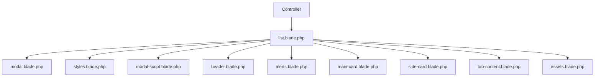

# Estrutura de Componentes - Banco

## 📋 Visão Geral

Este diretório contém a página de movimentações bancárias organizada em componentes modulares para melhor manutenibilidade e reutilização.

## 🗂️ Estrutura de Arquivos

```
resources/views/app/financeiro/banco/
├── list.blade.php                    # Arquivo principal reorganizado
├── components/                       # Componentes modulares
│   ├── modal.blade.php              # Modal de importação OFX
│   ├── styles.blade.php             # Estilos CSS
│   ├── modal-script.blade.php       # JavaScript do modal
│   ├── header.blade.php             # Cabeçalho da página
│   ├── alerts.blade.php             # Mensagens de alerta
│   ├── main-card.blade.php          # Card principal com informações
│   ├── side-card.blade.php          # Card lateral com lista de bancos
│   ├── tab-content.blade.php        # Conteúdo das abas
│   └── assets.blade.php             # CSS e JavaScript
└── README.md                        # Esta documentação
```

## 🔧 Componentes

### **1. `list.blade.php` (Arquivo Principal)**
- **Responsabilidade**: Estrutura principal da página
- **Conteúdo**: Layout base e inclusão dos componentes
- **Dependências**: Todos os componentes

### **2. `modal.blade.php`**
- **Responsabilidade**: Modal para importação de arquivos OFX
- **Funcionalidades**:
  - Upload de arquivos OFX
  - Drag & drop
  - Validação de tipo de arquivo
- **Variáveis**: Nenhuma

### **3. `styles.blade.php`**
- **Responsabilidade**: Estilos CSS específicos
- **Conteúdo**: Estilos para área de upload
- **Variáveis**: Nenhuma

### **4. `modal-script.blade.php`**
- **Responsabilidade**: JavaScript do modal
- **Funcionalidades**:
  - Eventos de drag & drop
  - Validação de arquivos
  - Atualização da interface
- **Variáveis**: Nenhuma

### **5. `header.blade.php`**
- **Responsabilidade**: Cabeçalho da página com breadcrumb
- **Conteúdo**:
  - Título da página
  - Navegação breadcrumb
- **Variáveis**: Nenhuma

### **6. `alerts.blade.php`**
- **Responsabilidade**: Exibição de mensagens de feedback
- **Tipos de mensagem**:
  - Sucesso (`session('success')`)
  - Erro (`session('error')`)
  - Validação (`$errors`)
- **Variáveis**: Nenhuma (usa sessão)

### **7. `main-card.blade.php`**
- **Responsabilidade**: Card principal com informações do banco
- **Conteúdo**:
  - Imagem do banco
  - Título e descrição
  - Botões de ação
  - Menu dropdown
  - Estatísticas financeiras
  - Navegação por abas
- **Variáveis**: `$total`, `$ValorSaidas`, `$valorEntrada`, `$activeTab`

### **8. `side-card.blade.php`**
- **Responsabilidade**: Card lateral com lista de bancos
- **Conteúdo**:
  - Carrossel de bancos
  - Informações de cada banco
  - Saldos e percentuais
- **Variáveis**: `$entidadesBanco`

### **9. `tab-content.blade.php`**
- **Responsabilidade**: Conteúdo das abas
- **Conteúdo**: Inclusão dinâmica baseada na aba ativa
- **Variáveis**: `$activeTab`

### **10. `assets.blade.php`**
- **Responsabilidade**: CSS e JavaScript da página
- **Conteúdo**:
  - CSS do Kendo UI
  - jQuery
  - Scripts customizados
  - SweetAlert2
  - DataTables
- **Variáveis**: `$lps`

## 📊 Fluxo de Dados



## 🎯 Benefícios da Organização

### ✅ **Manutenibilidade**
- **Código modular**: Cada componente tem responsabilidade específica
- **Fácil localização**: Problemas são facilmente identificados
- **Reutilização**: Componentes podem ser reutilizados

### ✅ **Legibilidade**
- **Estrutura clara**: Arquivo principal limpo e organizado
- **Separação de responsabilidades**: Cada arquivo tem um propósito
- **Documentação**: README explica a estrutura

### ✅ **Desenvolvimento**
- **Trabalho em equipe**: Diferentes desenvolvedores podem trabalhar em componentes diferentes
- **Debugging**: Mais fácil identificar e corrigir problemas
- **Testes**: Componentes podem ser testados individualmente

## 🔄 Como Usar

### **1. Modificar um Componente**
```php
// Editar o componente específico
resources/views/app/financeiro/banco/components/componente.blade.php
```

### **2. Adicionar Nova Variável**
```php
// No controller, passar a variável
return view('app.financeiro.banco.list', [
    'nova_variavel' => $valor
]);

// No componente, usar a variável
{{ $nova_variavel }}
```

### **3. Criar Novo Componente**
```php
// 1. Criar arquivo no diretório components/
// 2. Incluir no arquivo principal
@include('app.financeiro.banco.components.novo-componente')
```

## 🧪 Testando

### **1. Verificar Componentes**
- Acesse a página de banco
- Verifique se todas as abas funcionam
- Teste o modal de importação OFX
- Confirme se as mensagens aparecem

### **2. Verificar Responsividade**
- Teste em diferentes tamanhos de tela
- Verifique se os componentes se adaptam
- Confirme se os botões são acessíveis

## 📝 Notas Importantes

- **Funcionalidade Original**: Mantém toda a funcionalidade original
- **Performance**: Não há impacto na performance
- **SEO**: Estrutura HTML mantida
- **Compatibilidade**: Funciona com o sistema existente

## 🔧 Variáveis Necessárias

O controller deve passar as seguintes variáveis:

```php
return view('app.financeiro.banco.list', [
    'total' => $total,
    'ValorSaidas' => $ValorSaidas,
    'valorEntrada' => $valorEntrada,
    'activeTab' => $activeTab,
    'entidadesBanco' => $entidadesBanco,
    'lps' => $lps
]);
```

---

**Reorganizado em**: 2025-09-04  
**Versão**: 1.0.0  
**Compatibilidade**: Laravel 11+ com Bootstrap 5+
